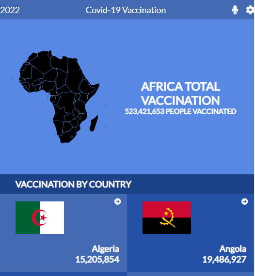
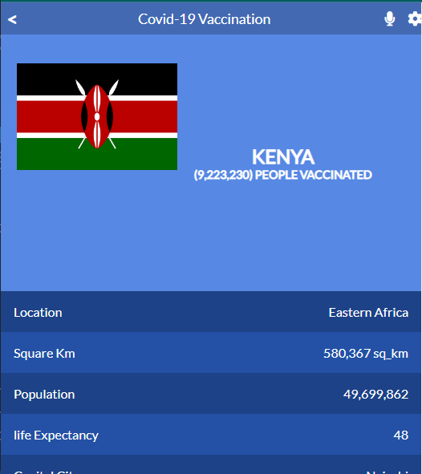

# Covid-19-Vaccination-Tracker

> A mobile app that counts the number of people in Africa who have been vaccinated against Covid-19. Data for all countries can be retrieved, as well as other details such as the capital city and the country's life expectancy.

## Live Demo

> [Live Demo](https://covid-19-vaccination-tracker-2022.netlify.app/)

## video Demo

<!-- > [Video Demo](https://drive.google.com/file/d/1M_Vd6bGCrfJu3IzBGFTtwJeqVHlkD1Us/view?usp=sharing) -->

> <h2 align="center">
  Demo 📝
</h2>

|                                                       **Interface 1**                                                       |
| :-------------------------------------------------------------------------------------------------------------------------: |
| 

|                                                       **Interface 2**                                                       |
| :-------------------------------------------------------------------------------------------------------------------------: |
|  
> Learning objectives: 

- Use React documentation.
- Use React components.
- Use React props.
- Use React Router.
- Connect React and Redux.
- Handle events in a React app.
- Write integration tests with a React testing library.
- Use styles in a React app.
- Use React life cycle methods.
- Apply React best practices and language style guides in code.
- Use store, actions and reducers in React.

- ## Built With

- React
- Redux
- JSX
- jest 
- ES6 

## Getting Started

To get a local copy up and running follow these simple example steps.
1. Download the `Zip` or `(git clone)[https://github.com/ericmahare/Covid-19-Vaccination-Tracker.git]`
2. `cd Covid-19-Vaccination-Tracker`
3. Then open in your browser by using `live server`\

**Install**

- On your terminal run : `npm i`
- To start the development server : `npm run start`
- In case you run into any errors please raise an [issue](https://github.com/ericmahare/Covid-19-Vaccination-Tracker/issues).

## Jest testing
For testing using jest follow these steps:
  > npm install
  `This will download all the dependencies`
  > npm test 
  `This will perform all the tests and display the result on the terminal`

## Linter errors testing
For tracking linter errors locally you need to follow these steps:

- After cloning the project you need to run this command
  > npm install
   `This command will download all the dependencies of the project`

- For tracking the linter errors in CSS file run:
  > npx stylelint "**/*.{css,scss}"

- And For tracking the linter errors in React files run:
  > npx eslint .

## Author

👤 **Eric Mahare**

- GitHub: [@erikmahare](https://github.com/ericmahare) 
- Twitter: [@erikmahare](https://twitter.com/erikmahare) 
- LinkedIn: [Eric Mahare](https://www.linkedin.com/in/eric-mahare-358944183/) 
## 🤝 Contributing

Contributions, issues, and feature requests are welcome!

Feel free to check the [issues page](../../issues/).

## Show your support

Give a ⭐️ if you like this project!

## Acknowledgments
- [Nelson Sakwa](https://www.behance.net/sakwadesignstudio) - for the original design
- [Covid-19 API](https://mmediagroup.fr/covid-19) - for displaying the covid-19 data
- [Flags API](https://countryflagsapi.com/). - for displaying the flags
- Hat tip to [Microvers](www.microverse.org)  and all the staff
- Thanks to My coding Partners 
- Thanks to My Morning-session-group and Standup-team Partners and
- Thanks to Code Reviewers

## 📝 License

This project is [MIT](./MIT.md) licensed.
                                                                                                                                 
